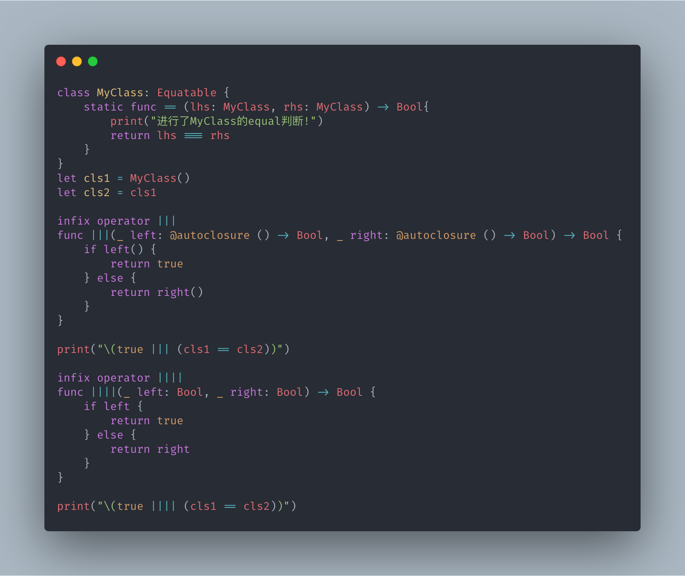
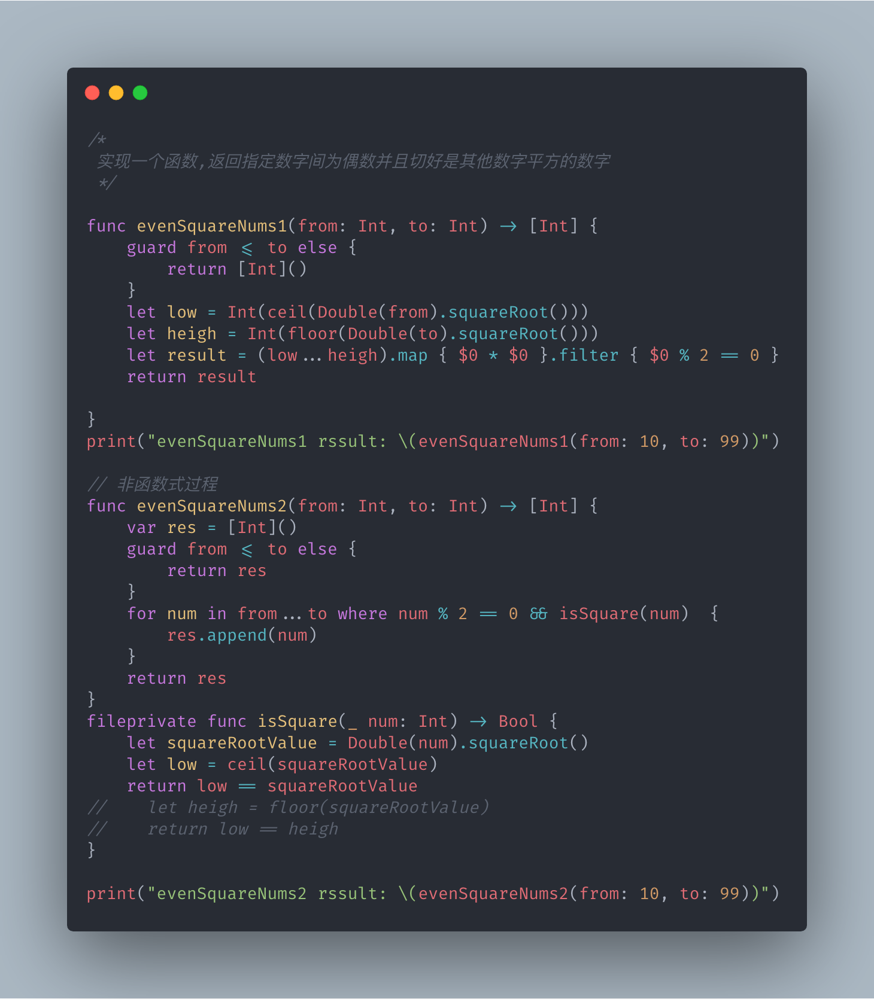
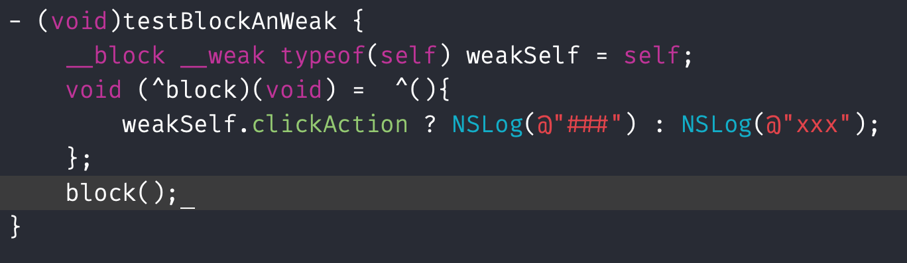
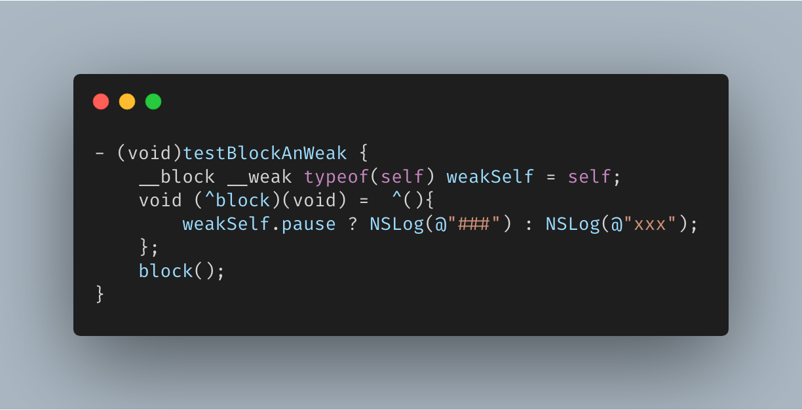

### # 延时计算的例子

**A**. `||` 的短路求值也是的延时计算的一个例子

```
class MyClass: Equatable {
    static func == (lhs: MyClass, rhs: MyClass) -> Bool{
        print("进行了MyClass的equal判断!")
        return lhs === rhs
    }
}
let my1 = MyClass()
let my2 = my1


infix operator |||

func |||(_ left: @autoclosure () -> Bool, _ right: @autoclosure () -> Bool) -> Bool {
    if left() {
        return true
    } else {
        return right()
    }
}


print("\( true ||| (my1 == my2)  )")


infix operator ||||

func ||||(_ left: Bool, _ right: Bool) -> Bool {
    if left {
        return true
    } else {
        return right
    }
}

print("\( true |||| (my1 == my2)  )")

```

打印结果为

```
true
进行了MyClass的equal判断!
true
```




可以看出,使用了 `@autoclosure` 处理后, `right` 部分的判断被延后执行了! `||` 的本质就是 `短路求值`.

**B**. `Collection` 的 `reversed()` 方法也是一个延时计算的经典例子,详情请参考官方文档;

	```
	// 返回集合中元素的逆序表示方式的数组
	/// - 复杂度: O(1)
	public func reversed() -> ReversedCollection<Self> {
		return ReversedCollection(_base: self)
	}
	```

### # 值捕获

```
/// 正确理解Swift中的值捕获

var outNum = 1

var closure1 =  {
    outNum += 1
    print("closure1: num = \(outNum)")
}
outNum += 1
var closure2 = { [outNum] in
    // outNum += 1 // 报错: 不能修改let变量
    print("closure2: num = \(outNum)")
}
outNum += 1
print("outNum = \(outNum)")

closure1()
closure2()
```

打印结果

```
outNum = 3
closure1: num = 4
closure2: num = 2
```

在 `closure2` 中 `outNum` 已经被参数(数组)捕获,所以在 `closure2` 内部访问 `outNum` 的值为代码执行到捕获 `outNum` 前当时的值;

### # 柯里化

```
/// 柯里化
func add(_ num: Int) -> (Int) -> Int {
    return {value in
        return num + value
    }
}
add(2)(3)
// 等同
let addTwo = add(2) // let addTwo: (Int) -> Int
addTwo(3)
```

### # 函数式编程(高级函数的使用)

> 实现一个函数,返回指定数字间为偶数并且切好是其他数字平方的数字

```
func evenSquareNums1(from: Int, to: Int) -> [Int] {
    guard from <= to else {
        return [Int]()
    }
    let low = Int(ceil(Double(from).squareRoot()))
    let heigh = Int(floor(Double(to).squareRoot()))
    let result = (low...heigh).map { $0 * $0 }.filter { $0 % 2 == 0 }
    return result

}
print("evenSquareNums1 rssult: \(evenSquareNums1(from: 10, to: 99))")

func evenSquareNums2(from: Int, to: Int) -> [Int] {
    var res = [Int]()
    guard from <= to else {
        return res
    }
    for num in from...to where num % 2 == 0 && isSquare(num)  {
        res.append(num)
    }
    return res
}
fileprivate func isSquare(_ num: Int) -> Bool {
    let squareRootValue = Double(num).squareRoot()
    let low = ceil(squareRootValue)
    return low == squareRootValue
//    let heigh = floor(squareRootValue)
//    return low == heigh
}

print("evenSquareNums2 rssult: \(evenSquareNums2(from: 10, to: 99))")

```




### # __block 与 __weak

`__block` 修饰的变量在 `ARC` 和 `非ARC` 中是有差别的。

`ARC` 有效时，`__block` 变量除了可以在 `Block` 内部 **修改** 之外，无其他用处，是否 `retain` 取决于变量的 `ARC` 修饰符（ `__strong` 持有、 `__weak` 不持有等）。那么由于可修改，因此可以在 `Block` 内部对造成循环引用的变量赋值为 `nil`，释放掉自身的对象持有权，从而打破循环。

`ARC` 无效时，在 `[block copy]` 之后，没有 `__block` 修饰符的变量对象会被自动后台 `retain` ，从而被 `Block` 持有；而有 `__block`  修饰符的变量反而不会被 `retain` ，不会被 `Block` 持有。因此对变量添加 `__block` 修饰符可以在 `非ARC` 情况下打破循环引用。




上图可以证明 `ARC` 下 `__block` 是可以和 `__weak`, `__strong` 一同使用的,并且是否被 `block` `retain` 由 `__weak` 或者 `__strong` 决定, `__block` 在 `ARC` 下解决循环应用的方式是可以在 `block` 内部将其置为 `nil`;

### # block 与 代理的区别

1. `block` 是集中代码块, `代理` 是分散代码块, 因此 `block` 更适合用于轻便,简单的回调,如网络传输等; 
   
   `代理`更适合公共接口较多的情况,这样也有利于解耦代码架构.
2. `block` 的运行成本较高,出栈时,需要将使用的数据从栈内存复制到堆内存中,还需要注意循环应用的问题.
	
	`代理` 只是保存了一个对象指针,直接回调,没有额外的消耗.
	
> 备注:虽然 `block` 和 `代理` 之间存在着差异,但是他们也可以共同使用已完成一些复杂的回调,例如系统的 `[UNUserNotificationCenterDelegate didReceiveNotificationResponse:withCompletionHandler:]` `代理方法` 中就是用了 `block` 回调


